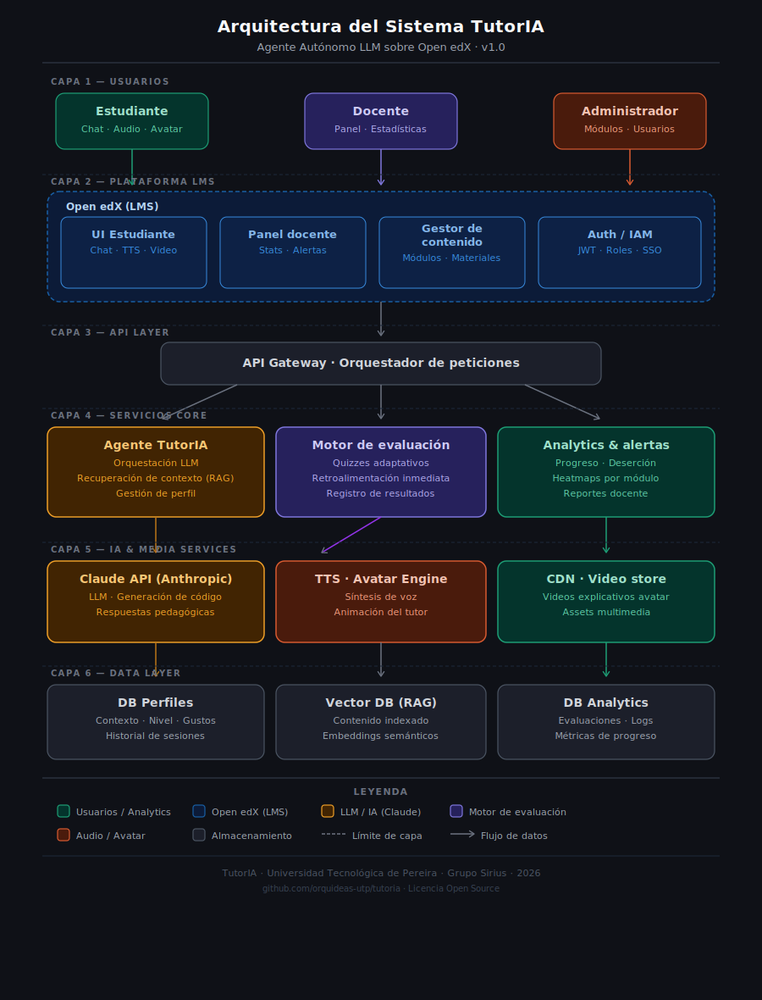

# TutorIA 🤖📚

> **Agente tutor virtual autónomo basado en IA para educación superior rural en Risaralda**  
> **Autonomous AI-powered virtual tutor agent for rural higher education in Risaralda, Colombia**

---

## Español

### ¿Qué es TutorIA?

TutorIA es un agente conversacional inteligente diseñado para acompañar a estudiantes de educación superior en zonas rurales del departamento de Risaralda, Colombia. Integrado dentro de la plataforma **Open edX**, utiliza la API de **Claude (Anthropic)** como motor de lenguaje para ofrecer tutoría personalizada, retroalimentación adaptativa y evaluaciones dinámicas.

### Características principales

- 💬 Chat conversacional en lenguaje natural
- 🎙️ Respuestas por audio (Text-to-Speech)
- 🧑‍🏫 Avatar visual animado
- 📊 Panel de estadísticas para docentes
- 🔁 Persistencia de contexto entre sesiones
- 📐 Asignaturas iniciales: Programación I (Python) e Introducción a la Matemática

## Arquitectura del sistema


📄 [Documento de requerimientos](docs/TutorIA_Requerimientos.pdf)


### Tecnologías

| Capa | Tecnología |
|------|-----------|
| Backend | Python · FastAPI · Anthropic Claude API |
| Frontend | React |
| LMS | Open edX (XBlock / Plugin) |
| Infraestructura | Docker · Microsoft Azure |
| CI/CD | GitHub Actions |

### Estructura del repositorio

```
tutoria/
├── backend/        # API y lógica del agente
├── frontend/       # Interfaz web y móvil
├── openedx/        # Plugin/XBlock para Open edX
├── infra/          # Docker, Azure, variables de entorno
├── data/           # Corpus pedagógico (texto plano)
├── tests/          # Pruebas unitarias y de integración
├── docs/           # Documentación técnica y de requerimientos
└── .github/        # GitHub Actions, plantillas de issues y PRs
```

### Cómo empezar

```bash
# 1. Clonar el repositorio
git clone https://github.com/Sof1SP/tutorIA.git
cd tutorIA

# 2. Copiar variables de entorno
cp .env.example .env
# Edita .env con tu API key de Anthropic y configuración de Azure

# 3. Levantar el entorno con Docker
docker-compose up --build
```

### Equipo

| Nombre | Rol |
|--------|-----|
| Dr. José Jaramillo Villegas | Director del Grupo de Investigación Sirius — dirección científica y técnica del proyecto |
| Dra. Luz Elena Grajales López | Dirección pedagógica — diseño del marco educativo, materiales y capacitación docente |
| Sofía Soto Parra | Joven investigadora — desarrollo de software, gestión del repositorio y calidad |
| Santiago  | Infraestructura cloud (Azure) |

**Institución:** Universidad Tecnológica de Pereira  
**Grupo de investigación:** Sirius  

### Licencia

Este proyecto es de código abierto bajo la licencia [MIT](LICENSE).

---

## English

### What is TutorIA?

TutorIA is an intelligent conversational agent designed to support higher education students in rural areas of the Risaralda department, Colombia. Integrated within the **Open edX** platform, it uses the **Claude (Anthropic)** API as its language engine to deliver personalized tutoring, adaptive feedback, and dynamic assessments.

### Key Features

- 💬 Natural language conversational chat
- 🎙️ Audio responses (Text-to-Speech)
- 🧑‍🏫 Animated visual avatar
- 📊 Statistics dashboard for teachers
- 🔁 Session context persistence
- 📐 Initial subjects: Programming I (Python) and Introduction to Mathematics

## System architecture


📄 [Requirements document](docs/TutorIA_Requerimientos.pdf)

### Tech Stack

| Layer | Technology |
|-------|-----------|
| Backend | Python · FastAPI · Anthropic Claude API |
| Frontend | React |
| LMS | Open edX (XBlock / Plugin) |
| Infrastructure | Docker · Microsoft Azure |
| CI/CD | GitHub Actions |

### Repository Structure

```
tutoria/
├── backend/        # Agent logic and API
├── frontend/       # Web and mobile UI
├── openedx/        # Open edX XBlock / Plugin
├── infra/          # Docker, Azure, environment config
├── data/           # Pedagogical corpus (plain text)
├── tests/          # Unit and integration tests
├── docs/           # Technical and requirements documentation
└── .github/        # GitHub Actions, issue and PR templates
```

### Getting Started

```bash
# 1. Clone the repository
git clone https://github.com/Sof1SP/tutorIA.git
cd tutorIA

# 2. Copy environment variables
cp .env.example .env
# Edit .env with your Anthropic API key and Azure config

# 3. Start the environment with Docker
docker-compose up --build
```

### Team

| Name | Role |
|------|------|
| Dr. José Jaramillo Villegas | Director of the Sirius Research Group — scientific and technical leadership |
| Dr. Luz Elena Grajales López | Pedagogical direction — educational framework design, materials and teacher training |
| Sofía Soto Parra | Junior researcher — software development, repository management and quality assurance |
| Santiago  | Cloud infrastructure (Azure) |

**Institution:** Universidad Tecnológica de Pereira  
**Research group:** Sirius  

### License

This project is open source under the [MIT License](LICENSE).

---

*Proyecto financiado en el marco del Sistema Nacional de Ciencia, Tecnología e Innovación (SNCTI) — Colombia.*  
*Project funded within the Colombian National System of Science, Technology and Innovation (SNCTI).*

